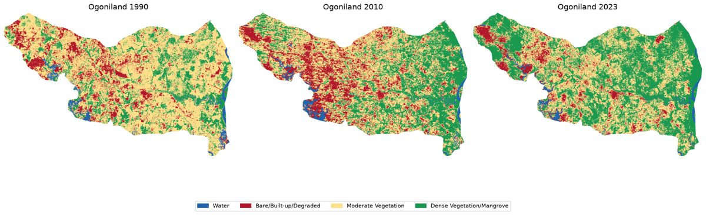
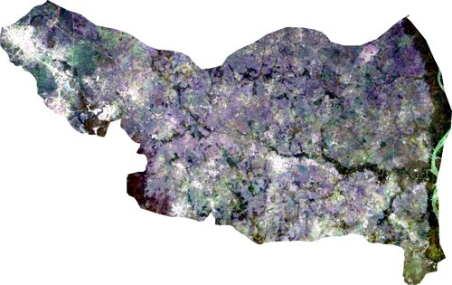
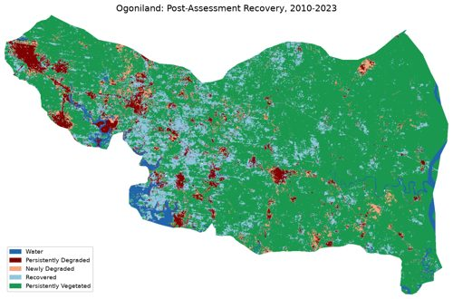

# Ogoniland Land-Use/Land-Cover Change Detection (1990–2023)



Multi-decadal remote sensing analysis of land-cover change in Ogoniland
(Khana, Gokana, Tai, and Eleme LGAs, Rivers State, Nigeria), examining
the environmental trajectory before and after the 2011 UNEP
Environmental Assessment of Ogoniland.

## Data

- **Source:** Landsat Collection 2 Level-2 surface reflectance, via Google Earth Engine
- **Sensors:** Landsat 5 TM (1990 epoch), Landsat 7 ETM+ (2010 epoch), Landsat 8 OLI (2023 epoch)
- **Compositing:** Cloud-masked dry-season (Nov–Mar) median composites
- **Study area boundary:** FAO GAUL 2015 administrative boundaries (Rivers State, Nigeria)


*True-color Landsat 8 composite of Ogoniland, 2023 epoch.*

| Epoch | Date range | Images composited |
|---|---|---|
| 1990 | 1984–1996 | 8 |
| 2010 | 2009–2012 | 20 |
| 2023 | 2022–2024 | 24 |

## Method

1. Cloud/shadow masking via QA_PIXEL bit flags
2. Computed NDVI, NDWI, and MNDWI per epoch
3. Classified into four categories using fixed index thresholds
   (validated against K-Means cluster analysis of each epoch):
   - Water: MNDWI > -0.1
   - Bare/Built-up/Degraded: NDVI < 0.40
   - Moderate Vegetation: 0.40 ≤ NDVI < 0.52
   - Dense Vegetation/Mangrove: NDVI ≥ 0.52
4. Pixel-level post-classification change detection between epochs
5. Zonal statistics computed per LGA using FAO GAUL boundary polygons
   rasterized to the classification grid

## Key findings

- Bare/Degraded land rose from 114.7 km² (1990) to a peak of 171.0 km²
  (2010, coinciding with the UNEP assessment period), then fell to 80.5 km²
  by 2023 — below the 1990 baseline.
- Dense Vegetation/Mangrove more than doubled, from 173.3 km² (1990) to
  398.7 km² (2023), a 130% increase.
- Net transitions confirm the pattern at the pixel level: 1990–2010 shows
  a net +56.0 km² conversion of vegetation to degraded land; 2010–2023
  shows a net -92.5 km² reversal.


*Spatial change map, 2010–2023: dark red = persistently degraded,
light blue = recovered (bare in 2010, vegetated by 2023).*

### Zonal breakdown by LGA

Aggregate figures mask real differences between Ogoniland's four LGAs.
Bare/Degraded land as a percentage of each LGA's own area:

| LGA | Area | 1990 | 2010 (peak) | 2023 | Change to peak | Recovery |
|---|---|---|---|---|---|---|
| Khana | 523.6 km² | 7.1% | 11.3% | 4.9% | +4.2pp | -6.4pp |
| Eleme | 126.6 km² | 23.9% | 26.7% | 21.0% | +2.8pp | -5.7pp |
| Tai | 102.3 km² | 28.1% | **41.0%** | 15.2% | +12.9pp | **-25.8pp** |
| Gokana | 93.7 km² | 19.6% | 38.3% | 13.6% | **+18.7pp** | -24.7pp |

Tai LGA had the single highest peak degradation of any LGA. Gokana LGA
had the largest percentage-point *increase* in degradation — notably,
Gokana is home to the Bomu oil field, the Bomu pipeline manifold, and
the towns of Bodo and K-Dere, sites of extensively documented Shell oil
spills. A documented industrial cause for Tai's peak was not verified
as part of this analysis and would be a natural next step.

## Limitations

- Landsat 5 has a well-documented historical coverage gap over West Africa;
  the "2010" epoch uses Landsat 7 instead, composited over 2009-2012 to
  compensate for post-2003 scan-line-corrector gaps.
- Fixed-threshold classification shows substantial bidirectional churn
  between the two vegetation classes in every period, a known artifact
  of hard thresholds near class boundaries; net-direction consistency
  across independently-computed periods supports the overall trend.
- No ground-truth field validation was available for the 1990 or 2010
  epochs; classification thresholds were derived from empirical cluster
  analysis rather than labeled training data.
- The 1990→2023 change map skips the intermediate 2010 epoch, so a
  pixel that degraded then recovered shows as unchanged; a separate
  2010→2023 map is included to isolate the post-assessment recovery
  specifically.

## Repository structure
├── README.md
├── images/ # web-ready thumbnails used in this README
├── data/
│ ├── raw/ # Landsat composites (gitignored, regenerate via script)
│ ├── processed/ # NDVI/NDWI/MNDWI rasters (gitignored, regenerate via script)
│ └── classified/ # classified rasters, transition CSVs, full-size maps
├── stage1_extract_composites.py # pulls Landsat composites via GEE
├── compute_indices.py # NDVI/NDWI/MNDWI per epoch
├── classify_final.py # threshold-based classification
├── change_matrix.py # pixel transition matrices between epochs
├── export_lga_boundaries.py # fetches LGA boundary polygons
├── zonal_stats.py # per-LGA land cover breakdown
├── change_map.py # spatial change map, 1990-2023
├── change_map_2010_2023.py # spatial change map, 2010-2023 (recovery)
├── true_color_images.py # true-color satellite images per epoch
└── visualize_classification.py # 3-panel classified comparison map
## Reproducing this analysis

Requires a registered Google Earth Engine project (free, Community Tier —
see https://code.earthengine.google.com/register) and: `earthengine-api`,
`geemap`, `rasterio`, `numpy`, `scikit-learn`, `matplotlib`, `geopandas`, `Pillow`.

```bash
python3 stage1_extract_composites.py
python3 compute_indices.py
python3 classify_final.py
python3 change_matrix.py
python3 export_lga_boundaries.py
python3 zonal_stats.py
python3 change_map.py
python3 change_map_2010_2023.py
python3 true_color_images.py
python3 visualize_classification.py
```
